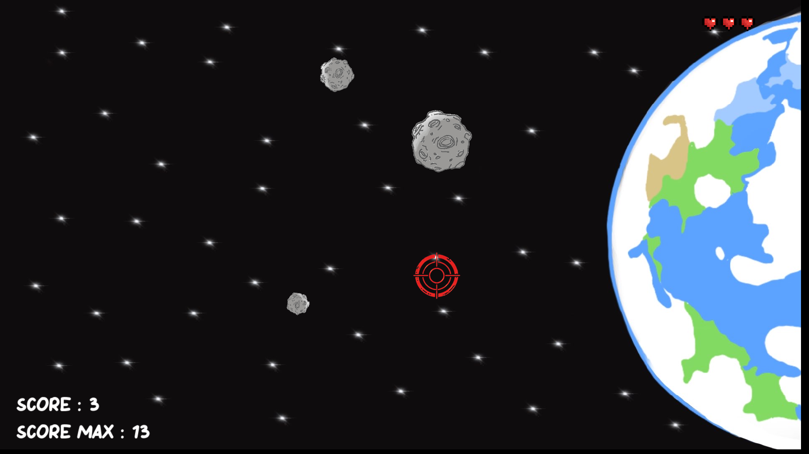

# My_Hunter

**My_Hunter** est un jeu de tir inspiré du célèbre jeu **Duck Hunt**, où vous devez défendre la Terre contre une pluie de météorites. Ce projet a été réalisé dans le cadre de l'EPITECH PROJECT 2024.

## 🎮 Description

Dans **My_Hunter**, vous incarnez un défenseur de la Terre équipé du **MegaLaser3000**, une arme développée pour détruire les météorites avant qu'elles n'atteignent la planète. Le jeu devient de plus en plus difficile à mesure que vous progressez, avec des météorites qui arrivent plus rapidement.

### Objectif :
- Détruisez un maximum de météorites pour obtenir le meilleur score possible.
- Évitez que plus de 3 météorites atteignent la Terre, sinon c'est la fin de la partie.

## 🚀 Fonctionnalités

- **Graphismes immersifs** : Utilisation de la bibliothèque **CSFML** pour des sprites et animations fluides.
- **Système de score** : Suivi du score en temps réel et enregistrement du meilleur score.
- **Difficulté progressive** : Les météorites accélèrent à mesure que vous progressez.
- **Effets sonores** : Sons d'explosion et de tir pour une meilleure immersion.
- **Menu principal** : Interface de démarrage avec un bouton pour lancer la partie.

## 🛠️ Installation et Compilation

### Prérequis :
- **GCC** ou tout autre compilateur compatible.
- **CSFML** (bibliothèque graphique basée sur SFML).

### Étapes :
1. Clonez le dépôt :
    ```bash
    git clone <url_du_dépôt>
    cd My_Hunter
    ```
2. Compilez le projet avec le `Makefile` :
    ```bash
    make
    ```
3. Lancez le jeu :
    ```bash
    ./my_hunter
    ```

## 🎯 Commandes

- **Souris** : Cliquez sur les météorites pour les détruire.
- **Échap** : Quittez le jeu.

## 📂 Structure du Projet

- `My_Hunter/` : Contient tous les fichier .c nécessaire au jeu.
- `include/` : Contient les fichiers d'en-tête.
- `ressources/` : Contient les ressources graphiques (sprites, arrière-plans, etc.).
- `max_score.txt` : Fichier pour enregistrer le meilleur score.
- `Makefile` : Automatisation de la compilation.

## 📸 Aperçu

